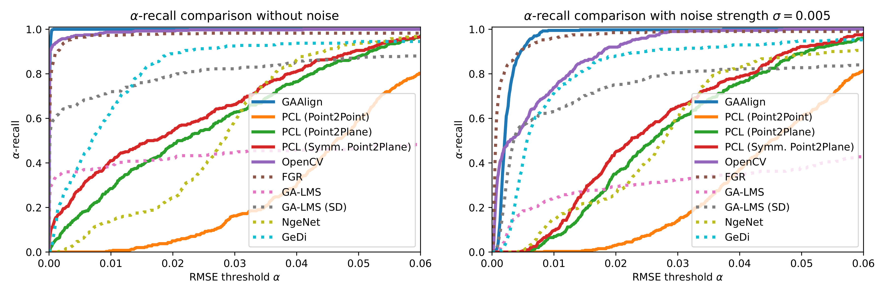

# GAAlign

A point cloud registration library based on projective geometric algebra (PGA). Official implementation of the paper <b>Robust Sampling-based Point Cloud Registration using Geometric Algebra</b>.

## Results

## Installation
### Note: Under windows we strongly recommend the use of vcpkg to install the 3rd party libraries.

<b>Required 3rd party libraries:</b>
- Boost (Components: filesystem, algorithm, program_options)
- Eigen3
- PCL (Components: common, filters)

<b>Optional 3rd party libraries (Only used by the testbench)</b>
- matplotlibcpp (which requires a working installation of python 3.x)
- OpenCV

<b>Optional 3rd party libraries (used for visualization)</b>
- PCL (Components: visualization)

## Gaalop Precompiler
This software uses the GAALOP Precompiler for creating optimized c++ code from geometric algebra directly inside c++. For this to work you need a recent build of the Precompiler (e.g. from the repository: https://github.com/CallForSanity/Gaalop) 

When compiling the project with Cmake you need to specify the following option:
> -DGPC_ROOT_DIR=...

If you want to use maxima for creating symbolically optimized code, you should also specify the options:
> -DGPC_WITH_MAXIMA=True \
-DMAXIMA_BIN=...

To enable <i>Common Sub Expression</i> optimization for better performance you can use the option:
> -DGPC_USE_GCSE=True

## Example Build calls
When using vcpkg in Windows you can use:

> -DCMAKE_TOOLCHAIN_FILE="C:\vcpkg\scripts\buildsystems\vcpkg.cmake" -DGPC_ROOT_DIR="C:\Users\Kai\Documents\Uni\Master\Semester4\GeometricAlgebraicComputing\GAALOP_Precompiler\GPC" -DGPC_USE_GCSE=True  -DENABLE_TESTBENCH=True

## Datasets
All models that are used inside the testbench are placed inside the <b>resources</b> folder. These models are used as part of the testbench and the full generated dataset is output to the <b>Datasets</b> folder. A precalcualted dataset will be available at this point at a later point in time.

## Usage
The application takes two parameters as input: First the source point cloud (which should be aligned) and secondly the target point cloud (which stays fixed).
> <b>gaalign-app.exe</b> <i>source.ply target.ply</i>

The testbench does not require any arguments.